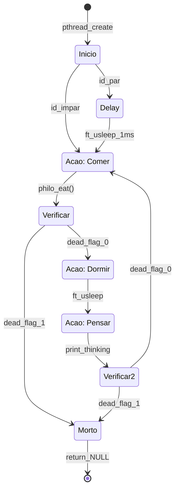
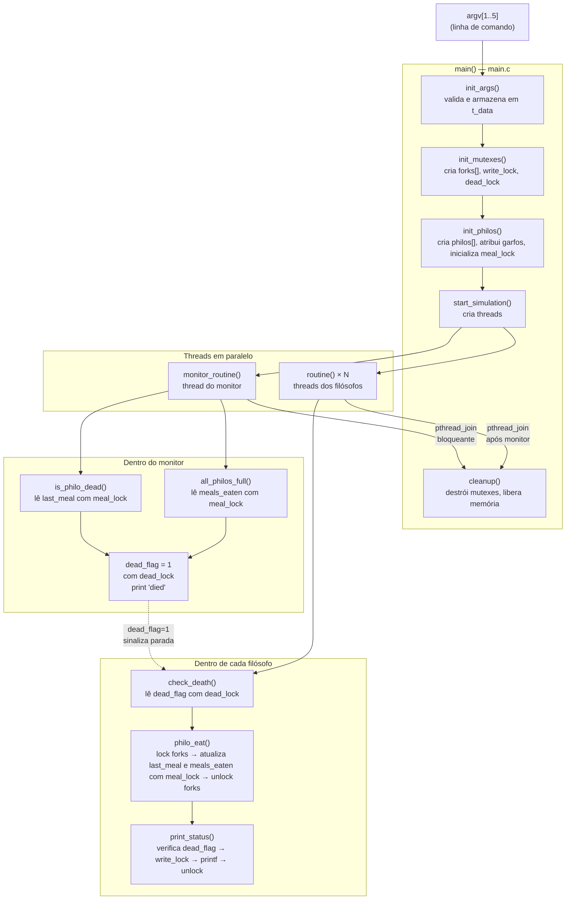
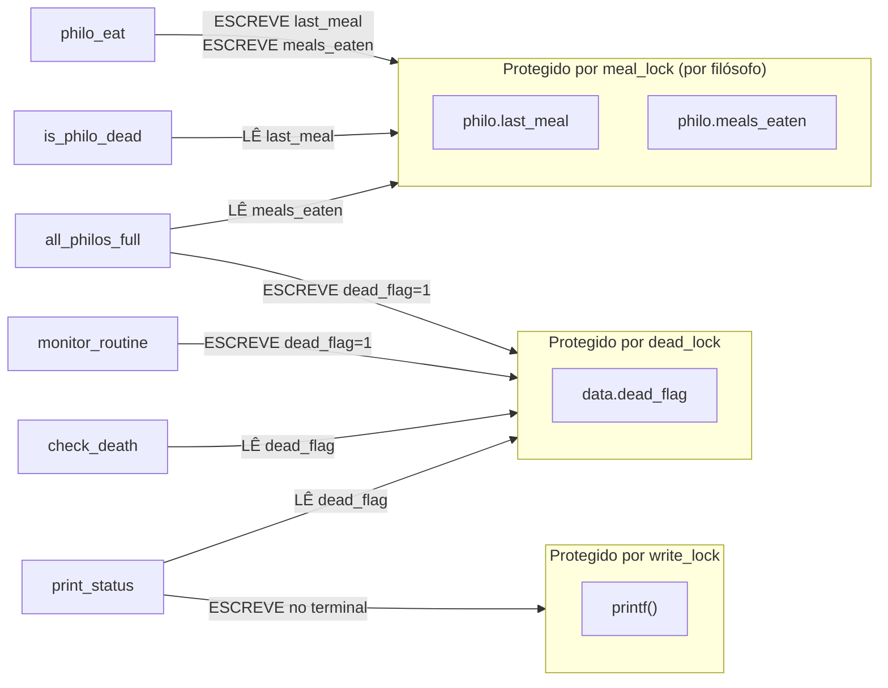

# Guia Mestre — Philosophers (42 School)

> Documentação técnica e didática do projeto Jantar dos Filósofos.  
> Referência: código em `/src/`. Linguagem: C99 + POSIX Threads.

---

## Sumário

1. [Conceitos Fundamentais](#1-conceitos-fundamentais)
2. [Arquitetura das Structs](#2-arquitetura-das-structs)
3. [Ciclo de Vida do Filósofo](#3-ciclo-de-vida-do-filósofo)
4. [Mapa de Fluxo de Dados](#4-mapa-de-fluxo-de-dados)
5. [Conectividade das Funções e Mutexes](#5-conectividade-das-funções-e-mutexes)
6. [Guia de Solução de Problemas](#6-guia-de-solução-de-problemas)
7. [Referência Rápida das Funções](#7-referência-rápida-das-funções)

---

## 1. Conceitos Fundamentais

### O que é uma Thread?

Uma **thread** é um fluxo de execução independente dentro de um processo. No projeto, cada filósofo *é* uma thread — todos existem ao mesmo tempo, no mesmo espaço de memória, competindo pelos mesmos garfos (mutexes).

```
Processo philo
├── thread: filósofo 1  ──┐
├── thread: filósofo 2  ──┤── compartilham: forks[], dead_flag, start_time
├── thread: filósofo 3  ──┤
└── thread: monitor     ──┘
```

**Analogia:** Imagine um restaurante com N garçons (filósofos) e N garfos compartilhados na mesa. Cada garçom trabalha de forma independente, mas todos precisam pegar os mesmos objetos físicos.

---

### O que é um Mutex?

**Mutex** = *Mutual Exclusion* (Exclusão Mútua). É uma trava que garante que apenas **uma thread por vez** acesse um recurso.

```c
pthread_mutex_lock(&fork);    // "Pego o garfo — outros esperam"
    /* seção crítica: só eu estou aqui */
    philo->last_meal = get_time();
pthread_mutex_unlock(&fork);  // "Larguei o garfo — próximo pode entrar"
```

<table>
<tr>
<th>Mutex no projeto</th>
<th>O que protege</th>
<th>Quem usa</th>
</tr>
<tr>
<td><code>forks[i]</code></td>
<td>Garfo físico na mesa</td>
<td><code>philo_eat()</code></td>
</tr>
<tr>
<td><code>write_lock</code></td>
<td>Saída do terminal (<code>printf</code>)</td>
<td><code>print_status()</code></td>
</tr>
<tr>
<td><code>dead_lock</code></td>
<td>Flag <code>dead_flag</code> (simulação parou?)</td>
<td><code>check_death()</code>, <code>monitor_routine()</code>, <code>print_status()</code></td>
</tr>
<tr>
<td><code>meal_lock</code> (por filósofo)</td>
<td><code>last_meal</code> e <code>meals_eaten</code></td>
<td><code>philo_eat()</code> (escrita), <code>monitor_routine()</code> (leitura)</td>
</tr>
</table>

---

### O que é um Data Race?

Um **Data Race** ocorre quando duas ou mais threads acessam a **mesma variável ao mesmo tempo**, e pelo menos uma está **escrevendo**, sem nenhuma sincronização.

<table style="border: 2px solid #c0392b; background: #fdf0f0;">
<tr><th colspan="2" style="background:#c0392b; color:white;">PERIGO — Data Race</th></tr>
<tr>
<td><b>Thread Filósofo 1</b></td>
<td><b>Thread Monitor</b></td>
</tr>
<tr>
<td><code>philo->last_meal = get_time();</code> ← escreve</td>
<td><code>time = philo->last_meal;</code> ← lê ao mesmo tempo</td>
</tr>
<tr>
<td colspan="2">
Resultado: o monitor pode ler um valor corrompido (metade do valor novo, metade do antigo) e declarar morte incorretamente.
</td>
</tr>
</table>

**Como o projeto resolve:** Toda leitura/escrita de `last_meal` e `meals_eaten` é protegida pelo `meal_lock` daquele filósofo.

```c
// ESCRITA (philo_eat)              // LEITURA (is_philo_dead / all_philos_full)
pthread_mutex_lock(&philo->meal_lock);   pthread_mutex_lock(&philo->meal_lock);
philo->last_meal = get_time();           time_since = get_time() - philo->last_meal;
philo->meals_eaten++;                    if (philo->meals_eaten >= limit) ...
pthread_mutex_unlock(&philo->meal_lock); pthread_mutex_unlock(&philo->meal_lock);
```

---

### O que é um Deadlock?

Um **Deadlock** é quando duas ou mais threads ficam esperando uma pela outra indefinidamente — nenhuma avança.

```
Filósofo 1 segura: fork[0]   →   espera: fork[1]
Filósofo 2 segura: fork[1]   →   espera: fork[0]
           ↑___________________________________|
                  Ciclo eterno — Deadlock!
```

**Como o projeto resolve:** Hierarquia de locks por endereço de memória — explicado em detalhes na [seção 6](#6-guia-de-solução-de-problemas).

---

## 2. Arquitetura das Structs

```mermaid
classDiagram
    class t_data {
        +int philo_num
        +int time_to_die
        +int time_to_eat
        +int time_to_sleep
        +int meals_limit
        +long start_time
        +int dead_flag
        +pthread_mutex_t[] forks
        +pthread_mutex_t write_lock
        +pthread_mutex_t dead_lock
        +t_philo[] philos
    }

    class t_philo {
        +int id
        +int meals_eaten
        +long last_meal
        +pthread_t thread
        +pthread_mutex_t meal_lock
        +pthread_mutex_t* left_fork
        +pthread_mutex_t* right_fork
        +t_data* data
    }

    t_data "1" --> "N" t_philo : contém array de
    t_philo --> t_data : ponteiro de volta (data*)
    t_philo --> "forks[i]" : left_fork aponta para
    t_philo --> "forks[(i+1)%N]" : right_fork aponta para
```

### Relação visual entre as structs

```
t_data (a "mesa")
├── philo_num = 5
├── time_to_die = 800
├── time_to_eat = 200
├── time_to_sleep = 200
├── dead_flag = 0  ←──────────────────────── protegido por dead_lock
├── start_time = 1715456258000
├── write_lock  (mutex para printf)
├── dead_lock   (mutex para dead_flag)
│
├── forks[0..4] (array de mutexes — os garfos físicos)
│     fork[0]  fork[1]  fork[2]  fork[3]  fork[4]
│       ↑         ↑         ↑         ↑         ↑
│       └── L     └── R     └── ...           └──┐
│                                                 │
└── philos[0..4] (array de t_philo)               │
      philos[0]: id=1, left=fork[0], right=fork[1]│
      philos[1]: id=2, left=fork[1], right=fork[2]│
      philos[2]: id=3, left=fork[2], right=fork[3]│
      philos[3]: id=4, left=fork[3], right=fork[4]│
      philos[4]: id=5, left=fork[4], right=fork[0]┘  ← wrap-around
```

<table>
<tr>
<th>Campo</th>
<th>Struct</th>
<th>Tipo de acesso</th>
<th>Protegido por</th>
</tr>
<tr>
<td><code>dead_flag</code></td>
<td>t_data</td>
<td>Leitura + Escrita</td>
<td><code>dead_lock</code></td>
</tr>
<tr>
<td><code>last_meal</code></td>
<td>t_philo</td>
<td>Leitura + Escrita</td>
<td><code>meal_lock</code> do filósofo</td>
</tr>
<tr>
<td><code>meals_eaten</code></td>
<td>t_philo</td>
<td>Leitura + Escrita</td>
<td><code>meal_lock</code> do filósofo</td>
</tr>
<tr>
<td><code>printf()</code></td>
<td>–</td>
<td>Escrita (saída)</td>
<td><code>write_lock</code></td>
</tr>
<tr>
<td><code>philo_num</code>, <code>time_to_*</code></td>
<td>t_data</td>
<td>Somente leitura após init</td>
<td>Não precisa (imutável)</td>
</tr>
</table>

---

## 3. Ciclo de Vida do Filósofo



### A rotina em código anotado

```c
void *routine(void *arg)
{
    t_philo *philo = (t_philo *)arg;

    // Filósofos pares esperam 1ms para evitar que todos
    // tentem pegar garfos ao mesmo tempo no início
    if (philo->id % 2 == 0)
        ft_usleep(1);

    while (!check_death(philo->data))   // ← verifica dead_flag com dead_lock
    {
        philo_eat(philo);               // ← ESTADO: COMENDO

        if (check_death(philo->data))   // ← verifica novamente antes de logar
            break;

        print_status(philo, "is sleeping");
        ft_usleep(philo->data->time_to_sleep);  // ← ESTADO: DORMINDO

        print_status(philo, "is thinking");     // ← ESTADO: PENSANDO
        // (sem sleep aqui — vai direto tentar comer)
    }
    return (NULL);  // thread encerra
}
```

---

## 4. Mapa de Fluxo de Dados

Este diagrama rastreia **onde cada dado nasce, transita e morre** no projeto.



### O "caminho" de cada variável crítica

```
argv[2] = "800" (time_to_die)
  └─► init_args() armazena em data.time_to_die  [imutável daqui em diante]
        └─► is_philo_dead() compara: get_time() - philo.last_meal >= data.time_to_die

argv[1] = "5" (número de filósofos)
  └─► init_args() → data.philo_num
        ├─► init_mutexes(): malloc(sizeof(mutex) * philo_num)  → data.forks[]
        ├─► init_philos():  malloc(sizeof(t_philo) * philo_num) → data.philos[]
        └─► loops em start_simulation(), monitor_routine(), all_philos_full()

philo.last_meal  (nasce em init_philos → atualizado em philo_eat → lido em is_philo_dead)
  └─► SEMPRE dentro de meal_lock

data.dead_flag   (nasce = 0 em init_philos → escrito pelo monitor → lido por todos)
  └─► SEMPRE dentro de dead_lock
```

---

## 5. Conectividade das Funções e Mutexes

### Quem lê e quem escreve em cada variável protegida



### Tabela de responsabilidades

<table>
<tr>
<th>Função</th>
<th>Arquivo</th>
<th>Lê</th>
<th>Escreve</th>
<th>Mutexes que usa</th>
</tr>
<tr>
<td><code>philo_eat()</code></td>
<td>threads.c</td>
<td>–</td>
<td><code>last_meal</code>, <code>meals_eaten</code></td>
<td><code>forks[first/second]</code>, <code>meal_lock</code></td>
</tr>
<tr>
<td><code>routine()</code></td>
<td>threads.c</td>
<td><code>dead_flag</code></td>
<td>–</td>
<td>via <code>check_death()</code></td>
</tr>
<tr>
<td><code>check_death()</code></td>
<td>threads.c</td>
<td><code>dead_flag</code></td>
<td>–</td>
<td><code>dead_lock</code></td>
</tr>
<tr>
<td><code>print_status()</code></td>
<td>utils.c</td>
<td><code>dead_flag</code></td>
<td>terminal</td>
<td><code>dead_lock</code>, <code>write_lock</code></td>
</tr>
<tr>
<td><code>is_philo_dead()</code></td>
<td>monitor.c</td>
<td><code>last_meal</code></td>
<td>–</td>
<td><code>meal_lock</code></td>
</tr>
<tr>
<td><code>all_philos_full()</code></td>
<td>monitor.c</td>
<td><code>meals_eaten</code></td>
<td><code>dead_flag</code></td>
<td><code>meal_lock</code>, <code>dead_lock</code></td>
</tr>
<tr>
<td><code>monitor_routine()</code></td>
<td>monitor.c</td>
<td>–</td>
<td><code>dead_flag</code></td>
<td>via funções acima</td>
</tr>
</table>

### Ordem de criação de threads em `start_simulation()`

```c
// threads.c — start_simulation()

data->start_time = get_time();               // (1) registra hora de início

pthread_create(&monitor_thread, ..., monitor_routine, data);  // (2) monitor primeiro

while (++i < data->philo_num)
    pthread_create(&philos[i].thread, ..., routine, &philos[i]); // (3) filósofos

pthread_join(monitor_thread, NULL);          // (4) espera monitor terminar (bloqueante)

while (++i < data->philo_num)
    pthread_join(philos[i].thread, NULL);    // (5) espera todos os filósofos
                                             //     (eles terminam porque dead_flag=1)
```

<table style="border: 2px solid #2980b9; background: #eaf4fb;">
<tr><th colspan="2" style="background:#2980b9; color:white;">INFO — Por que o monitor é criado primeiro?</th></tr>
<tr><td colspan="2">
O monitor precisa estar ativo <em>antes</em> dos filósofos começarem a comer para que nenhuma morte seja perdida no instante zero da simulação. Se os filósofos fossem criados primeiro, um filósofo com <code>time_to_die = 0</code> poderia morrer antes do monitor estar pronto.
</td></tr>
</table>

---

## 6. Guia de Solução de Problemas

### O problema: Deadlock clássico sem hierarquia

Imagine 5 filósofos ao redor de uma mesa circular. Sem ordenação:

```
Estado inicial (todos pegam o garfo esquerdo simultaneamente):

  Filósofo 1: segura fork[0], espera fork[1]
  Filósofo 2: segura fork[1], espera fork[2]
  Filósofo 3: segura fork[2], espera fork[3]
  Filósofo 4: segura fork[3], espera fork[4]
  Filósofo 5: segura fork[4], espera fork[0]
                                    ↑
                           DEADLOCK: ciclo fechado
                           Ninguém avança. Para sempre.
```

### A solução: Hierarquia de locks por endereço de memória

O projeto resolve isso em `philo_eat()` em `threads.c:8-41`:

```c
void philo_eat(t_philo *philo)
{
    pthread_mutex_t *first;
    pthread_mutex_t *second;

    // Compara os ENDEREÇOS de memória dos garfos
    if (philo->left_fork < philo->right_fork)
    {
        first  = philo->left_fork;   // endereço menor → pega primeiro
        second = philo->right_fork;
    }
    else
    {
        first  = philo->right_fork;  // endereço menor → pega primeiro
        second = philo->left_fork;
    }

    pthread_mutex_lock(first);   // sempre o de menor endereço primeiro
    // ...
    pthread_mutex_lock(second);  // depois o maior
}
```

### Por que isso quebra o ciclo?

Os garfos estão em `data->forks[]` — um array contíguo na memória:

```
Endereços de memória (exemplo):
  forks[0] → 0x55a0  (menor)
  forks[1] → 0x55c0
  forks[2] → 0x55e0
  forks[3] → 0x5600
  forks[4] → 0x5620  (maior)
```

Filósofo 5 tem `left_fork = forks[4]` e `right_fork = forks[0]`.  
Com a hierarquia: `forks[0] (0x55a0) < forks[4] (0x5620)` → ele pega `forks[0]` **primeiro**.

```
Com hierarquia (todos tentam pegar o de MENOR endereço primeiro):

  Filósofo 1: quer fork[0] e fork[1] → pega fork[0] primeiro ✓
  Filósofo 2: quer fork[1] e fork[2] → pega fork[1] primeiro ✓
  Filósofo 3: quer fork[2] e fork[3] → pega fork[2] primeiro ✓
  Filósofo 4: quer fork[3] e fork[4] → pega fork[3] primeiro ✓
  Filósofo 5: quer fork[4] e fork[0] → pega fork[0] primeiro ✓
                                              ↑
                              Conflito com Filósofo 1!
                              Filósofo 5 BLOQUEIA e espera.
                              Filósofo 1 pega fork[0] e fork[1] → come → libera.
                              Ciclo QUEBRADO. Sistema avança.
```

### Visualização do antes e depois

<table>
<tr>
<th style="background:#c0392b; color:white;">SEM hierarquia (Deadlock)</th>
<th style="background:#27ae60; color:white;">COM hierarquia (Correto)</th>
</tr>
<tr>
<td>

```
F1 → [fork0] → espera fork1
F2 → [fork1] → espera fork2
F3 → [fork2] → espera fork3
F4 → [fork3] → espera fork4
F5 → [fork4] → espera fork0
  ↑__________________________↑
         CICLO = DEADLOCK
```

</td>
<td>

```
F1 → [fork0] → [fork1] → come → libera
F5 →  espera fork0 (bloqueado)
      ↓ F1 libera fork0
F5 → [fork0] → [fork4] → come → libera
         ↑
    HIERARQUIA QUEBRA O CICLO
```

</td>
</tr>
</table>

### Por que o Helgrind detecta sem a hierarquia?

O Helgrind (ferramenta Valgrind) monitora a **ordem de aquisição de locks**. Se em algum momento ele detecta:

```
Thread A: lock(mutex_X) → lock(mutex_Y)
Thread B: lock(mutex_Y) → lock(mutex_X)   ← ordem invertida!
```

Ele reporta um potencial deadlock, mesmo que não tenha acontecido ainda. Com a hierarquia por endereço, **todos** os pares de garfos são sempre travados na mesma ordem global — o Helgrind não encontra inversão.

---

### Outros problemas comuns

<table>
<tr>
<th>Problema</th>
<th>Sintoma</th>
<th>Causa</th>
<th>Solução no código</th>
</tr>
<tr>
<td>Morte instantânea</td>
<td>Filósofo morre no ms 0</td>
<td><code>last_meal</code> não inicializado</td>
<td><code>init_philos()</code>: <code>last_meal = get_time()</code></td>
</tr>
<tr>
<td>Prints após morte</td>
<td>Mensagens aparecem depois de "died"</td>
<td>Threads imprimem sem verificar estado</td>
<td><code>print_status()</code> verifica <code>dead_flag</code> antes do printf</td>
</tr>
<tr>
<td>Filósofo único trava</td>
<td>1 filósofo nunca come, nunca morre</td>
<td>Espera o segundo garfo (que não existe)</td>
<td><code>philo_eat()</code>: caso <code>philo_num == 1</code> — dorme e retorna</td>
</tr>
<tr>
<td>Thundering herd</td>
<td>Todos competem no ms 0</td>
<td>Todos os filósofos tentam comer ao mesmo tempo</td>
<td><code>routine()</code>: filósofos pares fazem <code>ft_usleep(1)</code></td>
</tr>
<tr>
<td>printf entrelaçado</td>
<td>Linhas misturadas no terminal</td>
<td>printf não é atômico</td>
<td><code>write_lock</code> protege cada chamada de printf</td>
</tr>
</table>

---

## 7. Referência Rápida das Funções

| Função | Arquivo | Propósito | Thread |
|--------|---------|-----------|--------|
| `main()` | main.c | Ponto de entrada, orquestra init e simulação | Main |
| `ft_atoi_positive()` | main.c | Converte e valida argumentos | Main |
| `init_args()` | main.c | Preenche t_data com parâmetros | Main |
| `init_mutexes()` | init.c | Cria forks[], write_lock, dead_lock | Main |
| `init_philos()` | init.c | Cria philos[], atribui garfos, inicializa meal_lock | Main |
| `cleanup()` | init.c | Destrói todos os mutexes, libera malloc | Main |
| `start_simulation()` | threads.c | Cria threads (monitor + filósofos), faz join | Main |
| `routine()` | threads.c | Loop principal de cada filósofo | Filósofo |
| `philo_eat()` | threads.c | Pega garfos, come, atualiza timestamps | Filósofo |
| `check_death()` | threads.c | Lê dead_flag com dead_lock | Filósofo |
| `monitor_routine()` | monitor.c | Verifica mortes e limite de refeições | Monitor |
| `is_philo_dead()` | monitor.c | Verifica se um filósofo ultrapassou time_to_die | Monitor |
| `all_philos_full()` | monitor.c | Verifica se todos atingiram meals_limit | Monitor |
| `get_time()` | utils.c | Retorna tempo atual em ms | Qualquer |
| `ft_usleep()` | utils.c | Sleep preciso usando busy-wait leve | Qualquer |
| `print_status()` | utils.c | Print seguro (verifica dead_flag + write_lock) | Qualquer |

### Comandos úteis para debug

```bash
# Compilar
make

# Rodar: 5 filósofos, 800ms para morrer, 200ms comendo, 200ms dormindo
./philo 5 800 200 200

# Com limite de refeições: para quando cada um comeu 7 vezes
./philo 5 800 200 200 7

# Caso de 1 filósofo (deve morrer após time_to_die ms)
./philo 1 800 200 200

# Verificar data races com Helgrind (lento, mas completo)
valgrind --tool=helgrind ./philo 4 410 200 200

# Verificar memory leaks
valgrind --leak-check=full ./philo 5 800 200 200 7
```

---

*Documentação gerada para o projeto Philosophers — 42 School | maio 2026*
